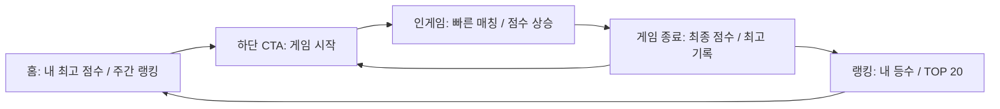
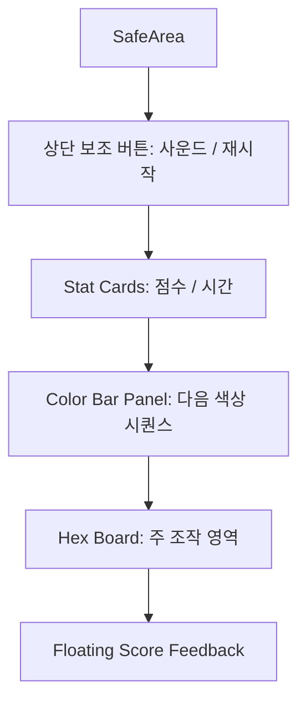

# 공용 게임 디자인 시스템 가이드

> 기준 프로젝트: NUMBERING / NUMBERING
> 목적: 이후 제작할 모바일 캐주얼 게임에서 동일한 브랜드 감성, UI 구조, 경쟁 루프, 피드백 감각을 재사용하기 위한 디자인 시스템 문서

---

## 0. 핵심 요약

NUMBERING의 디자인은 **밝은 캔버스 위에 두꺼운 먹선, 선명한 원색 포인트, 물리적인 하드 섀도, 큰 숫자, 짧고 빠른 인터랙션**으로 구성된다. 전체 감성은 “장난감처럼 직관적이지만, 랭킹과 점수는 진지하게 읽히는 캐주얼 경쟁 게임”에 가깝다.

이 시스템을 다른 게임에 적용할 때 반드시 유지해야 하는 브랜드 신호는 다음과 같다.

| 축 | 유지해야 할 원칙 |
|---|---|
| 화면 인상 | 밝은 배경, 검은 윤곽선, 흰색 카드, 선명한 CTA |
| 조작 감각 | 손가락에 바로 반응하는 120~320ms 애니메이션 |
| 경쟁 구조 | 내 점수/내 등수를 먼저 보여주고, TOP 리스트는 보조로 제공 |
| 숫자 표현 | 점수와 등수는 가장 큰 정보 계층으로 배치 |
| 모바일 기준 | 세로 화면, 한 손 엄지 조작, 하단 CTA 고정 |
| 감정 설계 | 실패는 짧게 처리하고, 다시 시작/랭킹/공유로 즉시 다음 행동 제시 |

---

## 1. 전체 디자인 철학

### 1.1 목표 감성

NUMBERING는 “가볍게 시작하지만 점수는 진지하게 남는 게임”을 목표로 한다. 밝고 귀여운 외형은 진입 장벽을 낮추고, 먹선/하드 섀도/랭킹 숫자는 경쟁의 명확함을 만든다.

| 감성 키워드 | 구현 방식 | 유저 경험 |
|---|---|---|
| 경쾌함 | 밝은 배경 `#F8F9FA`, 원색 타일, 짧은 애니메이션 | 부담 없이 바로 시작 |
| 장난감성 | 두꺼운 검은 테두리, 0 blur 하드 섀도 | 누르고 움직이는 물체처럼 느껴짐 |
| 명확함 | 큰 점수 카드, 단순한 HUD, 정보 축소 | 해야 할 일이 한눈에 보임 |
| 경쟁감 | 주간/일간 랭킹, TOP 1~3 색상 차등, 내 랭크 카드 | 한 판 더 해서 순위를 올리고 싶어짐 |
| 신뢰감 | 흰색 카드, 정돈된 리스트, 절제된 텍스트 | 랭킹/점수 데이터가 공식 기록처럼 느껴짐 |

### 1.2 유저에게 줘야 하는 느낌

유저는 게임을 켰을 때 다음 순서로 감정을 받아야 한다.

1. **내 기록 확인**: 홈 첫 화면에서 최고 점수와 티어/랭크를 바로 본다.
2. **행동 유도**: 하단의 큰 `게임 시작` 버튼이 가장 강하게 보인다.
3. **짧은 집중**: 인게임에서는 점수, 시간, 다음 색상 순서만 본다.
4. **즉시 평가**: 게임 종료 후 최종 점수, 최고 기록, 오늘의 랭킹을 즉시 확인한다.
5. **다음 행동**: 다시 시작, 랭킹 확인, 공유, 리플레이가 같은 화면에 제공된다.

이 흐름은 유저가 “게임을 이해한 뒤 플레이하는 것”이 아니라, **플레이하면서 이해하고 결과로 다시 동기화되는 구조**다.

### 1.3 “한 판 더”를 만드는 구조

NUMBERING의 반복 플레이 구조는 실력 향상, 시간 압박, 랭킹 확인을 짧은 루프로 묶는다.

핵심은 게임 종료 후 유저에게 실패 감정을 오래 남기지 않는 것이다. 결과 팝업은 “게임 오버”보다 **점수와 다음 액션**을 더 크게 보여준다. 패배 화면이 아니라 “다음 시도 준비 화면”처럼 작동한다.

### 1.4 캐주얼 / 전략 / 경쟁 요소 비율

| 요소 | 권장 비율 | 디자인 해석 |
|---|---:|---|
| 캐주얼 접근성 | 50% | 색상, 드래그, 큰 버튼, 짧은 문구로 즉시 이해 |
| 전략 판단 | 25% | 컬러 바의 연속 구간, 경로 선택, 콤보 타이밍 |
| 경쟁/랭킹 | 25% | 주간/일간 랭킹, 티어, 내 등수, TOP 20 |

다른 게임에 적용할 때도 이 비율을 유지한다. 전략성이 높아지는 장르라도 첫 화면과 핵심 조작은 캐주얼하게 두고, 경쟁 정보는 결과/랭킹 화면에서 선명하게 보여준다.

### 1.5 미니멀 vs 화려함

NUMBERING는 **구조는 미니멀, 피드백은 선명**한 방향이다.

- 화면 장식은 적다: 배경은 옅은 그리드와 희미한 컬러 셀 정도만 사용한다.
- UI 덩어리는 명확하다: 카드, 버튼, 랭킹 셀은 테두리와 섀도로 분리한다.
- 컬러는 기능적으로 쓴다: 파랑은 메인 액션, 호박색은 데일리/보상성 액션, 빨강은 위험/시간 압박이다.
- 애니메이션은 짧다: 화면 전환과 점수 피드백은 빠르게 끝난다.

### 1.6 UI 밀도 방향

홈과 랭킹은 정보를 압축해 보여주되, 인게임은 방해 요소를 줄인다.

| 화면 | UI 밀도 | 이유 |
|---|---|---|
| 홈 | 중간 | 내 점수, 주간 랭킹, 시작 버튼을 한 화면에서 연결 |
| 인게임 | 낮음 | 손가락 드래그와 보드 인지를 방해하지 않아야 함 |
| 게임 종료 | 중간~높음 | 결과와 다음 행동을 한 번에 제시 |
| 랭킹 | 중간 | 스캔 가능한 리스트와 내 위치 확인이 중요 |
| 설정 | 중간 | 카드형 행 구조로 반복 항목을 안정적으로 표시 |

### 1.7 모바일 한 손 플레이 기준

기본 기준은 **세로모드, 엄지 조작, 하단 CTA**다.

- 핵심 시작 버튼은 하단에 고정하거나 화면 하단 근처에 둔다.
- 인게임 조작 영역은 중앙~하단에 충분히 크게 둔다.
- 상단 HUD는 읽기 전용 정보 위주로 두고, 빈번한 조작 버튼은 작게 제한한다.
- 랭킹/설정은 바텀시트 또는 세로 스크롤 구조로 처리한다.
- 최소 터치 영역은 44x44dp, 주요 CTA는 52~72dp 높이를 유지한다.

---

## 2. 컬러 시스템

### 2.1 브랜드 컬러 원칙

NUMBERING의 컬러는 “밝은 종이 위에 놓인 색상 타일”처럼 보여야 한다. 색상은 많지만 화면 전체가 알록달록하게 흐려지면 안 된다. **배경과 카드가 중립을 잡고, 상호작용 요소만 고채도 컬러를 사용**한다.

### 2.2 컬러 토큰

| 역할 | HEX | 사용 위치 | 의도 |
|---|---|---|---|
| Charcoal / Ink | `#1A1A1A` | 텍스트, 테두리, 하드 섀도 | 브랜드의 물리감과 가독성 |
| App Background | `#F8F9FA` | 홈, 인게임, 설정 배경 | 밝고 안전한 기본 캔버스 |
| Card Surface | `#FFFFFF` | 카드, 팝업, 랭킹 셀 | 정보 덩어리 분리 |
| Primary Blue | `#0095FF` | 게임 시작, 브랜드 강조, 리플레이 진행 | 가장 강한 액션 |
| Daily / Reward Amber | `#F59E0B` | 오늘의 퍼즐, 보상성 CTA, 트로피 | 특별한 기회와 보상 |
| Info Blue | `#2563EB` | 일간 랭킹, 공식 기록, 내 랭크 강조 | 신뢰 가능한 기록 상태 |
| Success Mint | `#7AF0B5` / `#00D47C` | 성공 드래그, 타일 컬러 | 긍정 피드백 |
| Warning Orange | `#F97316` / `#FFCE6A` | 시간 경고 전 단계 | 긴장 상승 |
| Danger Red | `#EF4444` / `#DC2626` / `#FF7F7A` | 게임 오버, 오류, 시간 임박 | 즉각적인 주의 |
| Rank 1 Coral | `#FB7185` | 1위 | 감정적으로 가장 강한 TOP 강조 |
| Rank 2 Orange | `#FB923C` | 2위 | 따뜻한 상위권 강조 |
| Rank 3 Amber | `#FBBF24` | 3위 | 보상/메달 감각 |
| Participation Slate | `#E2E8F0` | 일반 참여/비상위 랭크 | 압박 완화 |

### 2.3 게임 타일 컬러

| 타일 | HEX | 성격 | 사용 규칙 |
|---|---|---|---|
| Coral | `#FF4D4D` | 강한 시각 자극 | 경고색과 혼동되지 않게 UI 텍스트 경고에는 쓰지 않음 |
| Amber | `#FFB300` | 따뜻한 보상감 | 데일리 CTA `#F59E0B`와 계열은 같지만 보드에서는 더 선명하게 |
| Mint | `#00D47C` | 성공/생명력 | 성공 상태와 연결 가능 |
| Azure | `#0095FF` | 브랜드 메인 액션 | CTA와 보드가 연결되는 핵심 컬러 |
| Violet | `#8F00FF` | 희귀성/특수성 | 명예의 전당, 특별 모드에 확장 가능 |
| Rainbow | Sweep Gradient | 와일드/희귀 블록 | 남발 금지, 희귀성과 보상성 유지 |

### 2.4 배경톤

| 배경 종류 | HEX | 규칙 |
|---|---|---|
| 기본 앱 배경 | `#F8F9FA` | 대부분의 화면 기본값 |
| 배경 그리드 | `#1A1A1A` 3.5% alpha | 화면에 구조감을 주되 콘텐츠와 경쟁하지 않음 |
| 희미한 장식 셀 | 타일 컬러 8% alpha | 브랜드 타일 감성을 암시 |
| 인게임 다크 캔버스 | `#0D1B24` | 필요 시 집중형 모드/보드 배경에 사용 |
| 다크 패널 | `#132734`, `#1A3444` | 다크모드 또는 집중형 게임판에 사용 |

### 2.5 카드톤

카드는 기본적으로 흰색이다. 카드 배경에 색을 넣는 경우는 상태를 설명할 때만 허용한다.

| 카드 상태 | 배경 | 테두리 |
|---|---|---|
| 기본 | `#FFFFFF` | `#1A1A1A`, 2px |
| 선택된 내 정보 | `#EFF6FF` | `#2563EB` 20% |
| 오늘의 퍼즐 안내 | `#E0F2FE` 또는 `#EFF6FF` | `#1A1A1A` 또는 `#BFDBFE` |
| 오류/재시도 | `#FEF2F2` | `#1A1A1A` 또는 red alpha |
| 비활성/빈 상태 | `#F8FAFC` | charcoal 8~12% |

### 2.6 승리/패배 컬러

NUMBERING에는 전통적인 “승리 화면”보다 점수 갱신/랭킹 결과가 중요하다.

| 상황 | 컬러 | 이유 |
|---|---|---|
| 점수 획득 | `#FFFFFF` 말풍선 + `#1A1A1A` 테두리 | 보드 위에서 가독성 확보 |
| 콤보 | `#FFE066` 또는 `Colors.amberAccent` | 특별한 연속 성공 감각 |
| 최고 기록 | `#3B82F6` NEW 배지 | 실패 화면에서도 긍정 기억을 남김 |
| 패배/게임 오버 | `#EF4444` | 결과를 명확히 알리되 넓게 칠하지 않음 |
| 시간 임박 | `#F97316` → `#FF0000` | 단계적으로 긴장을 올림 |

### 2.7 남발 금지 규칙

- `#0095FF`는 가장 중요한 CTA 또는 브랜드 핵심 액션에만 쓴다.
- `#F59E0B`는 데일리, 보상, 시즌, 트로피처럼 “특별한 기회”에 쓴다.
- 빨강 계열은 실패/위험/오류/시간 임박에만 쓴다. 일반 강조에 쓰면 게임이 불안하게 느껴진다.
- TOP 1~3 컬러는 랭킹 문맥에서만 쓴다. 일반 버튼에 쓰면 메달의 의미가 약해진다.
- 배경 장식은 3~8% alpha를 넘기지 않는다.
- 하나의 화면에서 고채도 포인트 컬러는 2개 이하로 제한한다.

### 2.8 다크모드 기준

현재 핵심 브랜드는 라이트 모드 중심이다. 다크모드를 만들 경우 다음처럼 변환한다.

| 역할 | 라이트 | 다크 |
|---|---|---|
| 배경 | `#F8F9FA` | `#0D1B24` |
| 카드 | `#FFFFFF` | `#132734` |
| 카드 보조 | `#F8FAFC` | `#1A3444` |
| 텍스트 | `#1A1A1A` | `#F3F2E9` |
| 테두리 | `#1A1A1A` | `#F3F2E9` 80~100% |
| 섀도 | `#1A1A1A` | 검정보다 밝은 선/내부 그림자 사용 |

다크모드에서도 핵심은 고채도 타일과 명확한 윤곽선이다. 단, 흰색 카드의 장난감 감성이 약해질 수 있으므로 라이트 모드를 기본 브랜드 모드로 유지하는 것을 권장한다.

---

## 3. 타이포그래피 시스템

### 3.1 폰트 역할

NUMBERING는 두 종류의 타이포 감각을 조합한다.

| 역할 | 권장 폰트 | 사용 위치 | 이유 |
|---|---|---|---|
| Display / Score / Button | Black Han Sans | 로고, 점수, 등수, CTA | 두껍고 즉각적이며 캐주얼 게임의 타격감이 큼 |
| Body / 설명 / 보조 정보 | Noto Sans | 설명문, 닉네임, 상태 텍스트 | 모바일 가독성이 좋고 긴 한국어에 안정적 |
| 시스템 보조 | 기본 TextStyle | HUD 라벨, 짧은 상태 | 렌더링 안정성 |

### 3.2 타입 스케일

| 토큰 | 크기 | 굵기 | 사용 |
|---|---:|---:|---|
| Display | 64 | 900 | 대형 브랜드/히어로 타이틀 |
| Headline | 32 | 900 | 보조 히어로, 중형 점수 |
| Title | 24 | 900 | 화면/팝업 제목 |
| Subtitle | 20 | 900 | 섹션 제목 |
| Body | 16 | 600 | 기본 본문 |
| Body Small | 14 | 500~700 | 설명, 닉네임, 보조 정보 |
| Label | 12 | 800~900 | BEST SCORE, WEEKLY 등 대문자 라벨 |
| Caption | 11 | 700~800 | 리셋 시간, 상태 |
| Tiny | 9 | 800~900 | YOU, ME 같은 마이크로 배지 |
| Score Display | 48~84 | 900 | 홈 점수, 결과 점수 |
| Ranking Number | 18~36 | 900 | 랭킹 리스트/내 랭크 |

### 3.3 제목 스타일

- 제목은 짧아야 한다. `RANKING`, `SETTINGS`, `오늘의 퍼즐`처럼 1~2단어로 끝낸다.
- 큰 제목은 Black Han Sans를 사용한다.
- 영문 대문자 라벨은 letter spacing 1.0~2.0을 허용한다.
- 한글 제목은 letter spacing 0 또는 -0.5에 가깝게 유지한다.

### 3.4 숫자 강조 방식

숫자는 이 게임의 가장 중요한 보상 피드백이다.

| 숫자 유형 | 위치 | 스타일 |
|---|---|---|
| 홈 최고 점수 | 화면 중앙 카드 | Black Han Sans, 32~60, 검정 |
| 게임 결과 점수 | 게임오버 팝업 중앙 | Black Han Sans, 84, 검정 |
| 내 랭킹 | MyRankCard | 36, 기간별 accent color |
| 랭킹 리스트 점수 | 리스트 우측 | 15~16, Black Han Sans |
| HUD 점수/시간 | 상단 카드 | 24, 색상 accent |
| 캘린더 일자 | 날짜 칩 중앙 | 13, Black Han Sans |

숫자에는 쉼표를 사용한다. `10000`보다 `10,000`이 점수의 성취감을 더 크게 만든다.

### 3.5 랭킹 숫자 디자인

TOP 1~3은 숫자 색상만으로도 차별화한다.

| 등수 | 컬러 | 표현 |
|---:|---|---|
| 1 | `#FB7185` | 가장 감정적인 코랄, 시선 선점 |
| 2 | `#FB923C` | 오렌지, 상위권 유지 |
| 3 | `#FBBF24` | 메달 감각 |
| 4+ | charcoal 20~25% | 리스트의 안정감 유지 |

등수 숫자는 아이콘보다 숫자를 우선한다. 캐주얼 경쟁 UI에서는 유저가 “몇 등인지”를 즉시 읽어야 하므로, 트로피 아이콘은 헤더/버튼 보조에만 둔다.

### 3.6 버튼 텍스트 스타일

- 주요 CTA: Black Han Sans, 18~30, letter spacing 0, 가운데 정렬
- 보조 CTA: Black Han Sans, 18, letter spacing 0.8까지 허용
- 작은 액션 필: Body Small 12, weight 900
- 버튼 안의 텍스트는 1줄을 원칙으로 한다.

### 3.7 작은 설명 텍스트 규칙

- 작은 설명은 Noto Sans 11~14, weight 700~800을 사용한다.
- 색상은 charcoal 30~55% alpha로 낮춘다.
- 설명은 기능 안내보다 상태 설명에 집중한다.
- 모바일에서 두 줄 이상이 되면 CTA와 경쟁하므로, 가능하면 `maxLines: 1` + ellipsis를 사용한다.

### 3.8 왜 이 타이포 구조가 중독성을 만드는가

중독성은 “내 행동이 숫자로 즉시 커진다”는 감각에서 나온다. NUMBERING는 설명보다 숫자를 크게 보여준다. 게임 종료 화면의 84px 점수, 홈 카드의 큰 최고점, 랭킹 카드의 36px 등수는 유저에게 다음 목표를 숫자로 각인한다.

경쟁 UI에서는 다음 원칙을 유지한다.

- 점수와 등수는 문장 안에 숨기지 않는다.
- 내 등수는 리스트 속 한 줄이 아니라 별도 카드로 먼저 보여준다.
- TOP 1~3은 색상으로 즉시 구분한다.
- 최고 기록/NEW 상태는 작은 배지로 덧붙여 실패 감정을 완화한다.

---

## 4. 버튼 & 인터랙션 시스템

### 4.1 버튼 공통 규칙

NUMBERING 버튼은 “평면 버튼”이 아니라 “누를 수 있는 물체”처럼 보여야 한다.

| 속성 | 기본값 |
|---|---|
| Border | `#1A1A1A`, 2px |
| Shadow | `#1A1A1A`, offset 2~4px, blur 0 |
| Radius | 12~28px |
| 주요 CTA 높이 | 52~72dp, 태블릿 64~88dp |
| 아이콘 버튼 | 40~48dp |
| 터치 영역 | 최소 44x44dp |
| 텍스트 | Black Han Sans, 굵게 |

### 4.2 Primary Button

| 항목 | 규칙 |
|---|---|
| 용도 | 게임 시작, 다시 시작, 가장 중요한 진행 |
| 배경 | `#0095FF` |
| 텍스트 | 흰색, Black Han Sans, 18~30 |
| Radius | 24~28 |
| Shadow | charcoal, offset 3, blur 0 |
| Border | charcoal 2px |
| 높이 | 모바일 52~72, 태블릿 64~88 |
| 위치 | 하단 고정 또는 화면 하단 근처 |

**왜 필요한가**  
Primary Button은 유저의 다음 행동을 고민 없이 결정하게 만든다. 파란색은 브랜드 메인 컬러이면서 가장 강한 액션이므로, 한 화면에 하나만 둔다.

### 4.3 Secondary Button

| 항목 | 규칙 |
|---|---|
| 용도 | 홈, 랭킹, 리플레이, 공유, 설정 이동 |
| 배경 | 흰색 |
| 텍스트 | charcoal |
| Radius | 18~20 |
| Shadow | charcoal, offset 3, blur 0 |
| Border | charcoal 2px |
| 높이 | 56~64 |

**응용**  
결과 화면에서 Secondary Button은 2열 그리드로 배치한다. 한 손 조작에서는 버튼이 너무 작아지지 않도록 각 버튼 최소 높이 56을 유지한다.

### 4.4 Danger Button

| 항목 | 규칙 |
|---|---|
| 용도 | 계정 삭제, 오류 재시도, 실패/위험 상태 |
| 배경 | `#FEF2F2` 또는 흰색 |
| 텍스트 | `#B91C1C` / `#DC2626` |
| Border | charcoal 1.5~2px 또는 red alpha |
| Radius | 12~18 |

**주의**  
Danger Button은 넓은 면적을 빨강으로 채우지 않는다. NUMBERING의 패배 스트레스는 낮아야 하므로, 빨강은 문맥 표시와 작은 액션에 제한한다.

### 4.5 Reward Button

| 항목 | 규칙 |
|---|---|
| 용도 | 오늘의 퍼즐, 보상 수령, 시즌 보너스, 광고 보상 |
| 배경 | `#F59E0B` |
| 텍스트 | charcoal |
| 특수 효과 | 2.4초 shimmer 또는 약한 pulse |
| Radius | Primary와 동일 |
| 위치 | 일반 CTA와 경쟁하지 않도록 별도 탭/섹션에 배치 |

**왜 필요한가**  
Reward Button은 “지금 하지 않으면 아까운 기회”를 표현한다. 파랑 CTA가 일반 플레이를 의미한다면, 호박색 CTA는 특별 이벤트/일일 참여를 의미한다.

### 4.6 Ranking Button

| 항목 | 규칙 |
|---|---|
| 용도 | 랭킹 화면 진입 |
| 배경 | 흰색 또는 `#FFFBEB` |
| 아이콘 | 트로피 또는 `emoji_events` |
| 텍스트 | Black Han Sans 16~18 |
| 보조 표시 | chevron right |
| Shadow | charcoal offset 3 |

**응용**  
랭킹 버튼은 CTA처럼 과하게 강조하지 않고 “내 위치 확인”의 보조 욕구를 만든다. 홈에서는 주간 랭킹 프리뷰 카드의 헤더 자체가 랭킹 버튼 역할을 할 수 있다.

### 4.7 Icon Button

| 항목 | 규칙 |
|---|---|
| 용도 | 설정, 뒤로가기, 사운드, 리셋, 닫기 |
| 크기 | 40~48 |
| Radius | 12~14 또는 원형 |
| Border | charcoal 2~2.5px |
| Shadow | offset 2 |
| 아이콘 컬러 | charcoal 50~100% |

**모바일 UX 기준**  
아이콘 버튼은 시각 크기가 40이어도 터치 영역은 44 이상이어야 한다. 인게임 상단 버튼은 자주 누르는 대상이 아니므로 작게 유지하고, 보드 영역을 침범하지 않는다.

### 4.8 클릭/눌림 애니메이션

| 인터랙션 | 권장값 |
|---|---|
| 버튼 tap down | scale 0.97~0.99 또는 shadow offset 감소 |
| 버튼 tap up | 100~140ms easeOutCubic |
| 활성 탭 전환 | 200~220ms easeOutCubic |
| 페이지 전환 | 260~300ms easeOutCubic |
| 보상/특별 CTA shimmer | 1800~2400ms 반복 |

현재 구현은 Flutter 기본 버튼 반응과 `AnimatedContainer`, `Transform.scale`, shimmer를 조합한다. 새 게임에서는 **누름 순간 그림자가 줄어드는 효과**를 추가하면 하드 섀도 스타일과 더 잘 맞는다.

### 4.9 손맛을 만드는 버튼 구조

좋은 버튼 손맛은 색이 아니라 **입력-반응 간격**에서 나온다.

- 터치 즉시 시각 변화가 있어야 한다.
- 결과가 늦어도 버튼은 먼저 눌린 느낌을 준다.
- 성공/실패는 snackbar나 팝업보다 버튼 상태 변화로 먼저 알려준다.
- 로딩 중에는 텍스트를 `입장 중...`, `공유 중`처럼 바꾸고 spinner를 버튼 내부에 둔다.

---

## 5. 랭킹 시스템 디자인 분석

### 5.1 랭킹 UI 구조

NUMBERING의 랭킹은 다음 계층으로 구성된다.

1. 랭킹 바텀시트: 화면의 90% 높이, 상단 handle, 둥근 상단 모서리
2. 헤더: `RANKING` 또는 날짜별 랭킹 제목
3. 기간 탭: Weekly / 명예의 전당
4. 내 랭크 카드: 내 등수와 점수를 큰 숫자로 표시
5. TOP 플레이어 라벨
6. 스캔 가능한 랭킹 리스트

이 구조의 핵심은 **내 위치를 먼저 보여준 뒤 전체 경쟁을 보여주는 것**이다. 유저가 TOP 20 안에 없어도 내 랭크 카드가 있으면 랭킹 화면을 볼 이유가 생긴다.

### 5.2 점수 강조 방식

| 위치 | 강조 방식 | 이유 |
|---|---|---|
| 내 랭크 카드 | 등수 36px + 점수 36px | 유저의 현재 위치를 즉시 인식 |
| 랭킹 리스트 | 점수 우측 정렬 | 비교 스캔이 쉬움 |
| 홈 프리뷰 | TOP 5만 표시 | 경쟁감을 주되 부담을 줄임 |
| 게임오버 | 최종 점수 84px | 플레이 직후 성취감을 크게 각인 |

점수는 항상 숫자만 독립적으로 크게 둔다. `P`, `점`, `위` 같은 단위는 작게 붙여 정보 위계를 낮춘다.

### 5.3 TOP 1~3 차별화

TOP 1~3은 별도 카드로 과장하지 않고 숫자 컬러로만 차별화한다. 이 방식은 리스트 밀도를 유지하면서도 상위권을 즉시 읽게 만든다.

| 등수 | 시각 처리 | 심리 효과 |
|---:|---|---|
| 1 | 코랄 숫자 | 가장 강한 선망 |
| 2 | 오렌지 숫자 | 아쉽지만 높은 위치 |
| 3 | 앰버 숫자 | 메달권 보상감 |
| 4+ | 연한 charcoal | “나도 도달 가능”한 일반 영역 |

다른 게임에서 상위 3명을 더 크게 보여주고 싶다면, 리스트 상단에 Podium을 추가할 수 있다. 단, NUMBERING 계열에서는 과한 왕관/폭죽보다 **숫자와 색상 중심의 절제된 차별화**가 브랜드에 맞다.

### 5.4 시즌 구조

NUMBERING의 시즌 구조는 주간 랭킹과 티어로 설계되어 있다.

| 시즌 요소 | 현재 방향 |
|---|---|
| 주간 초기화 | 월요일 00:00 KST |
| 티어 | Bronze, Silver, Gold, Platinum, Diamond, Master, Challenger, Jesus |
| 티어 산정 | 점수 기준 또는 참가자 percentile |
| 홈 노출 | 최고 점수 카드 하단에 티어/랭크 작게 표시 |
| 랭킹 노출 | MyRankCard에 티어 라벨 표시 |

`Jesus`는 주간 점수 500,000점 이상에서 부여하는 최상위 티어다.

시즌은 유저에게 “영구 최고 기록”과 다른 목표를 준다. 영구 랭킹은 넘기 어려운 벽이 되기 쉽지만, 주간 랭킹은 매주 다시 도전할 수 있는 가벼운 경쟁장을 만든다.

### 5.6 승급/강등 연출

현재 코드에는 승급/강등 전용 연출이 강하게 구현되어 있지 않다. 같은 브랜드 감성으로 확장할 경우 다음 규칙을 추천한다.

| 상황 | 연출 |
|---|---|
| 승급 | 티어 배지가 220ms scale up, 앰버/민트 sparkle 3~5개 |
| 강등 위험 | 빨강 대신 slate/amber 경고 필, 문구는 부드럽게 |
| 시즌 종료 | 결과 카드: 이번 주 등수, 티어, 다음 시즌 CTA |
| TOP 3 진입 | 랭킹 숫자 컬러 전환 + 짧은 bounce |

강등은 스트레스를 크게 만들 수 있으므로 “내려감”보다 “다음 시즌 목표”로 표현한다.

### 5.7 리더보드 심리 설계

“조금만 더 하면 올라갈 것 같은 느낌”은 실제 순위보다 **거리 정보**에서 나온다.

반드시 추가하면 좋은 정보:

| 정보 | 예시 | 효과 |
|---|---|---|
| 다음 순위까지 점수 | `12위까지 280점` | 즉시 재도전 목표 |
| 내 주변 5명 | 14~18위 표시 | TOP권이 아니어도 비교 가능 |
| 주간 남은 시간 | `월 00:00 리셋` / `2일 남음` | 지금 플레이할 이유 |
| 개인 최고 대비 | `최고 기록까지 1,200점` | 자기 경쟁 유도 |
| 시즌 티어 경계 | `Gold까지 3,500점` | 장기 목표 |

### 5.8 재사용 가능한 랭킹 디자인 패턴

| 패턴 | 구성 | 적용 장르 |
|---|---|---|
| My Rank First | 내 등수/점수 카드 + TOP 리스트 | 모든 경쟁형 캐주얼 게임 |
| Weekly Reset | 주간 탭 + 리셋 타이머 | 퍼즐, 액션, 러너 |
| Daily Challenge | 날짜별 기록 + 하루 1회 공식 점수 | 퍼즐, 전략, 퀴즈 |
| Hall of Fame | 전체 최고 기록 탭 | 장기 플레이 게임 |
| Top 3 Color Rank | 1~3위 숫자 색상 차등 | 리스트 기반 랭킹 |
| Nearby Rival | 내 주변 순위 강조 | 유저 수가 많은 게임 |
| Tier Badge | 시즌 티어 + 색상 점 | 반복 플레이 게임 |

### 5.9 실시간 랭킹 vs 시즌 랭킹

| 방식 | 장점 | 단점 | NUMBERING 계열 권장도 |
|---|---|---|---|
| 실시간 랭킹 | 즉각 경쟁감, 추월 쾌감 | 피로도 높음, 서버 비용 증가 | 중간 |
| 일간 랭킹 | 짧은 목표, 공정한 하루 경쟁 | 하루 1회 제한 설계 필요 | 높음 |
| 주간 랭킹 | 재도전 동기, 시즌감 | 초반/후반 온도 차이 | 매우 높음 |
| 전체 랭킹 | 명예와 장기 목표 | 신규 유저에게 벽처럼 보임 | 보조로 사용 |

NUMBERING 계열에서는 **주간 랭킹을 기본, 일간 랭킹을 이벤트/공식 도전, 전체 랭킹을 명예의 전당**으로 쓰는 구조가 가장 안정적이다.

---

## 6. 애니메이션 시스템

### 6.1 애니메이션 철학

애니메이션은 장식이 아니라 “내 입력이 처리됐다는 증거”다. NUMBERING의 애니메이션은 대부분 120~320ms 안에 끝나며, 특별한 CTA만 1800~2400ms의 느린 반복 효과를 가진다.

### 6.2 애니메이션 토큰

| 토큰 | 시간 | Easing | 사용 |
|---|---:|---|---|
| Instant Feedback | 100~140ms | easeOutCubic | 버튼 눌림, 슬롯 하이라이트 |
| Short State | 180~220ms | easeOutCubic | 탭 전환, 선택 칩 |
| List/Stream Move | 260ms | easeInOutCubic | 컬러 바 이동 |
| Page Transition | 260~300ms | easeOutCubic/easeInOut | 홈 탭, 튜토리얼 페이지 |
| Board Refill | 320ms | easeOutCubic | 타일 리필 |
| Score Float | 1000ms | easeOutCubic | 점수/콤보 말풍선 |
| Critical Flash | 600ms | linear fade | 시간 임박 |
| Passive Pulse | 1800ms | easeInOut | 기본 시작 버튼 약한 pulse |
| Reward Shimmer | 2400ms | easeInOut | 오늘의 퍼즐 CTA |

### 6.3 버튼 반응 애니메이션

- 일반 버튼: Flutter 기본 ripple보다 scale/섀도 이동을 우선 고려한다.
- Primary CTA: 1800ms, 1.0 → 1.025 pulse로 “누를 수 있음”을 암시한다.
- Reward CTA: shimmer를 사용하되 텍스트 가독성을 해치지 않는다.
- 탭/칩: `AnimatedContainer` 180~220ms로 배경색 전환.

### 6.4 승리/성공 연출

NUMBERING는 큰 승리 연출보다 작은 성공을 자주 준다.

| 성공 유형 | 연출 |
|---|---|
| 매칭 성공 | 드래그 라인 success mint, 타일 clearing opacity 감소 |
| 콤보 | amber 말풍선, 살짝 기울임 |
| 최고 기록 | 게임오버 카드 내 `NEW!` 배지 |
| 랭킹 상승 | 내 랭크 숫자 scale + 색상 flash 권장 |

### 6.5 점수 증가 연출

점수 상승은 보드 중앙 또는 마지막 매칭 경로 중심에서 떠오른다.

- duration: 1000ms
- opacity: 0 → 1 → 0
- 이동: y 10 → -40
- easing: easeOutCubic
- 배경: 흰색 또는 combo amber
- 테두리: charcoal 3px
- 섀도: y 4, blur 0

이 방식은 유저의 손가락 근처에서 결과가 발생하게 하므로, 점수 HUD를 보지 않아도 성공을 느낄 수 있다.

### 6.6 랭킹 상승 연출

다른 게임에 적용할 때 추천하는 랭킹 상승 패턴:

1. 게임오버 직후 점수 확정
2. 내 기존 랭크 → 새 랭크 숫자 카운트/슬라이드
3. `+3 RANK` 또는 `12위 진입` 같은 짧은 배지
4. 다음 순위까지 점수 표시

단, 연출은 1.2초를 넘기지 않는다. 유저가 바로 다시 시작할 수 있어야 한다.

### 6.7 보상 획득 연출

보상은 “짧게 빛나고 바로 소유된다”는 느낌이 좋다.

| 보상 | 연출 |
|---|---|
| 코인 | 숫자 카운트업 300ms + 아이콘 이동 |
| 아이템 | 카드 scale 0.92 → 1.0, 220ms easeOutBack |
| 티어 | 배지 회전/스파클 최소화 |
| 광고 보상 | 로딩 → 수령 완료 → CTA 복귀 |

### 6.8 과한 애니메이션을 피해야 하는 이유

캐주얼 게임에서 과한 애니메이션은 세 가지 문제를 만든다.

- 반복 플레이 속도를 늦춘다.
- 실력 게임에서 입력 피드백을 흐린다.
- 랭킹/점수의 신뢰감을 떨어뜨린다.

NUMBERING 계열은 “반응은 빠르고, 축하는 짧게”가 맞다. 유저가 다시 시작 버튼을 누르기 전까지 기다리게 만들면 안 된다.

---

## 7. HUD / 인게임 UI 구조

### 7.1 기본 구조

인게임 화면은 세로모드 기준으로 다음 구조를 가진다.

### 7.2 상단 정보 배치

| 정보 | 위치 | 이유 |
|---|---|---|
| 점수 | 상단 좌측 카드 | 게임 진행 중 성과 확인 |
| 시간 | 상단 우측 카드 | 압박 정보, 점수와 같은 위계 |
| 데일리 모드 배지 | HUD 상단 좌측 | 공식 기록 여부를 알려줌 |
| 사운드/재시작 | 상단 우측 | 보조 조작, 빈번히 누르지 않음 |
| 컬러 바 | 점수 카드 아래 | 다음 행동을 결정하는 핵심 정보 |

### 7.3 점수 위치

점수는 상단 카드에 두지만, 점수 획득 피드백은 보드 중앙/매칭 위치에 띄운다. 이중 구조가 중요하다.

- HUD 점수: 누적 상태 확인
- Floating 점수: 방금 성공한 행동의 즉시 보상

### 7.4 코인 / 체력바 / 미니맵 적용 기준

현재 NUMBERING에는 코인, 체력바, 미니맵이 없다. 다른 게임에서 추가할 때는 다음 기준을 따른다.

| 요소 | 권장 위치 | 주의 |
|---|---|---|
| 코인 | 홈/상점 상단, 인게임에서는 숨김 또는 작게 | 플레이 집중을 방해하면 안 됨 |
| 체력바 | 인게임 상단, 시간 카드 대체 또는 보조 | 빨강 면적 과다 사용 금지 |
| 미니맵 | 전략/자동전투에서만 우측 상단 | 한 손 조작 영역과 겹치지 않게 |
| 스킬 버튼 | 하단 엄지 영역 | 보드/드래그 게임에서는 비권장 |

### 7.5 손가락 가림 최소화

- 주 조작 보드는 화면 중앙~하단에 충분히 크게 둔다.
- Floating 점수는 터치 지점보다 위로 떠오르게 한다.
- CTA는 인게임 중에는 숨기고, 게임 종료 후에만 하단/팝업에 배치한다.
- 상단 HUD는 손가락 이동 경로와 겹치지 않는다.

### 7.6 집중을 방해하지 않는 HUD 설계

인게임 HUD는 “다음 판단에 필요한 정보”만 남긴다.

남길 정보:

- 점수
- 제한 시간
- 다음 색상/목표
- 현재 모드 배지

숨길 정보:

- 상점/광고
- 전체 랭킹 리스트
- 장문의 설명
- 이벤트 배너
- 계정 정보

---

## 8. 재사용 가능한 컴포넌트 시스템

### 8.1 컴포넌트 공통 토큰

| 속성 | 값 |
|---|---|
| Surface | `#FFFFFF` |
| Border | charcoal 2px |
| Shadow | charcoal, offset 3px, blur 0 |
| Radius | 카드 20~24, 팝업 28~32, 칩 12~16 |
| Padding | 카드 14~24, 팝업 24~40 |
| Max Width | 모바일 480, 태블릿 680~720 |

### 8.2 카드 UI

| 항목 | 규칙 |
|---|---|
| 목적 | 정보 덩어리를 독립된 물체처럼 분리 |
| 사용 상황 | 점수 카드, 랭킹 프리뷰, 설정 섹션, 데일리 카드 |
| 구성 요소 | 흰색 배경, 2px 검은 테두리, 3px 하드 섀도, 20~24 radius |
| 재사용 규칙 | 한 카드 안에 또 다른 큰 카드를 중첩하지 않는다 |

### 8.3 팝업 UI

| 항목 | 규칙 |
|---|---|
| 목적 | 결과, 튜토리얼, 닉네임 수정 등 집중 행동 |
| 사용 상황 | 게임오버, 튜토리얼, 계정/설정 다이얼로그 |
| 구성 요소 | 흰색 surface, 28~32 radius, 2~3px border, 3~8px hard shadow |
| 재사용 규칙 | 닫기/뒤로가기 아이콘은 상단 우측 또는 헤더에 고정 |

팝업은 전체 화면을 가리지 않더라도 배경 dim을 사용해 집중을 만든다. 게임오버는 검정 85% overlay로 결과에 완전히 집중시킨다.

### 8.4 랭킹 셀

| 항목 | 규칙 |
|---|---|
| 목적 | 등수, 닉네임, 점수를 빠르게 비교 |
| 사용 상황 | 전체 랭킹, 데일리 랭킹, 홈 프리뷰 |
| 구성 요소 | 좌측 등수, 중앙 닉네임, 우측 점수 |
| 재사용 규칙 | 점수는 우측 정렬, 닉네임은 ellipsis, 내 셀은 연한 파랑 배경 |

TOP 1~3 색상은 숫자에만 적용하고, 셀 전체 배경을 강하게 칠하지 않는다.

### 8.5 상점 아이템 카드

현재 프로젝트에는 상점이 없지만, 같은 시스템으로 확장할 때는 다음 구조를 쓴다.

| 항목 | 규칙 |
|---|---|
| 목적 | 구매 가능한 아이템/스킨/부스터 표시 |
| 사용 상황 | 상점, 보상 교환, 스킨 선택 |
| 구성 요소 | 아이템 이미지, 이름, 가격, 상태 배지, 구매 버튼 |
| 재사용 규칙 | 구매 CTA는 Primary Blue 또는 Reward Amber가 아니라, 가격/재화 색상과 연결 |

상점 카드는 과도하게 화려하면 게임의 정돈된 경쟁 UI와 충돌한다. 아이템 비주얼은 컬러풀하게, 카드 구조는 흰색/먹선으로 유지한다.

### 8.6 보상 팝업

| 항목 | 규칙 |
|---|---|
| 목적 | 보상 획득을 짧게 확인 |
| 사용 상황 | 데일리 보상, 광고 보상, 시즌 종료 |
| 구성 요소 | 보상 아이콘, 수량 숫자, 확인 CTA |
| 재사용 규칙 | 보상 숫자는 크게, 설명은 짧게 |

보상 팝업은 자동으로 길게 머무르지 않는다. 유저가 바로 확인하고 다음 액션으로 이동할 수 있어야 한다.

### 8.7 로딩 화면

| 항목 | 규칙 |
|---|---|
| 목적 | 데이터 로딩의 불안을 줄임 |
| 사용 상황 | 랭킹 로드, 로그인, 데일리 입장 |
| 구성 요소 | 작은 CircularProgressIndicator, charcoal 또는 낮은 alpha |
| 재사용 규칙 | 전체 로딩 화면보다 컴포넌트 내부 로딩을 우선 |

랭킹/점수 로딩은 비동기 데이터지만, 화면 전체를 막지 않는다. 가능한 기존 카드 안에서 spinner를 보여준다.

### 8.8 프로필 UI

| 항목 | 규칙 |
|---|---|
| 목적 | 내 기록의 주체를 명확히 함 |
| 사용 상황 | 홈 상단 닉네임, 설정 프로필, 랭킹 내 셀 |
| 구성 요소 | 닉네임, 편집 아이콘, 이메일/계정 정보 |
| 재사용 규칙 | 닉네임은 한 줄 ellipsis, 편집은 작은 아이콘으로만 표시 |

프로필은 게임 경험의 중심이 아니므로 과도한 아바타보다 닉네임과 랭킹 연결을 우선한다.

### 8.9 시즌 배너

| 항목 | 규칙 |
|---|---|
| 목적 | 현재 시즌/주간 경쟁 상태 표시 |
| 사용 상황 | 홈 점수 카드 하단, 랭킹 카드, 시즌 종료 화면 |
| 구성 요소 | 티어 컬러 점, 티어 라벨, 등수, 리셋 타이머 |
| 재사용 규칙 | 홈에서는 작게, 시즌 결과 화면에서는 크게 |

### 8.10 미션 UI

| 항목 | 규칙 |
|---|---|
| 목적 | 반복 플레이 목표 제공 |
| 사용 상황 | 데일리 미션, 시즌 미션, 튜토리얼 과제 |
| 구성 요소 | 아이콘, 미션명, 진행 수치, 보상, CTA |
| 재사용 규칙 | 한 카드에 하나의 미션만 강조하고, 보상 색은 amber 사용 |

미션 UI는 랭킹과 충돌하지 않게 보상/성장 루프로 배치한다. 홈 첫 화면의 가장 강한 자리는 항상 플레이 CTA와 내 점수에 둔다.

---

## 9. UX 원칙

### 9.1 유저를 기다리게 하지 않는 구조

- 앱 진입 후 홈에서 바로 내 최고 점수와 시작 버튼을 보여준다.
- 랭킹은 로딩 중에도 시트 구조를 먼저 보여주고 spinner만 둔다.
- 데일리 입장 중에는 버튼 텍스트를 `입장 중...`으로 바꾼다.
- 실패한 데이터 로드는 `다시 불러오기`로 카드 내부에서 회복한다.
- 게임 종료 후 업로드/랭킹 집계가 늦어도 결과 화면은 먼저 보여준다.

### 9.2 한 번에 하나만 집중시키는 구조

각 화면의 주인공은 하나다.

| 화면 | 주인공 |
|---|---|
| 홈 | 내 최고 점수 + 게임 시작 |
| 오늘의 퍼즐 탭 | 날짜 선택 + 오늘의 퍼즐 CTA |
| 인게임 | 보드와 컬러 바 |
| 게임오버 | 최종 점수 |
| 랭킹 | 내 랭크 카드 |
| 설정 | 설정 행 |

광고, 상점, 미션, 이벤트가 추가되어도 한 화면의 주인공을 빼앗으면 안 된다.

### 9.3 보상 타이밍

보상은 세 단계로 나눈다.

1. **즉시 보상**: 매칭 성공 말풍선, 점수 상승, 효과음/햅틱
2. **라운드 보상**: 최종 점수, 최고 기록, 리플레이/공유
3. **장기 보상**: 랭킹, 티어, 시즌 결과

이 세 단계가 분리되어 있어야 반복 플레이가 유지된다. 즉시 보상만 있으면 가볍고, 장기 보상만 있으면 피곤하다.

### 9.4 패배 스트레스 완화

- 게임오버는 빨간 화면으로 덮지 않는다.
- 최종 점수를 가장 크게 보여준다.
- 최고 기록/NEW를 함께 표시한다.
- 다시 시작 버튼을 가장 위에 둔다.
- 데일리 1회 제한처럼 재시도가 불가능한 경우 홈으로 돌아가는 이유를 snackbar로 부드럽게 안내한다.

### 9.5 반복 플레이 유도 구조

반복 플레이는 “다시 시작” 버튼만으로 만들 수 없다.

필수 요소:

- 홈에서 최고 점수 상기
- 게임 종료에서 최고 기록 비교
- 랭킹에서 다음 목표 제시
- 주간 리셋으로 경쟁 초기화
- 데일리 공식 도전으로 희소성 제공
- 리플레이/공유로 결과를 다시 소비

### 9.6 랭킹 압박감 조절

랭킹은 강력하지만 피로를 만든다. NUMBERING 계열에서는 다음처럼 압박을 낮춘다.

- 홈 프리뷰는 TOP 5만 보여준다.
- 내 티어/랭크는 작게 표시한다.
- 전체 랭킹은 바텀시트로 분리한다.
- 일간 도전은 하루 1회 공식 기록으로 공정성을 강조한다.
- 전체 랭킹보다 주간 랭킹을 기본으로 둔다.

### 9.7 광고 UX 원칙

광고가 추가될 경우 다음 원칙을 지킨다.

| 광고 유형 | 허용 위치 | 금지 |
|---|---|---|
| 보상형 광고 | 게임오버 이후, 보상 팝업, 상점 | 인게임 중 강제 노출 |
| 전면 광고 | 2~3판 이후 자연스러운 종료 시점 | 첫 판 직후, 데일리 공식 기록 직후 |
| 배너 광고 | 홈/상점 하단 보조 영역 | 보드 주변, CTA 바로 위 |

광고 CTA는 Reward Button 계열로 만들 수 있지만, 일반 플레이 CTA보다 강하게 보이면 안 된다.

### 9.8 “삭제하지 않고 계속 남기는 게임”의 UX 특징

오래 남는 캐주얼 게임은 매일 큰 시간을 요구하지 않는다. 대신 짧은 복귀 이유를 제공한다.

- 하루 한 번 확인할 이유: 오늘의 퍼즐
- 매주 돌아올 이유: 주간 랭킹 리셋
- 오래 쌓이는 이유: 명예의 전당/최고 기록
- 결과를 남길 이유: 리플레이/공유
- 설정 피로가 낮은 이유: 사운드/진동/닉네임만 단순하게 제공

핵심은 유저에게 “지금 1분만 해도 의미가 있다”는 느낌을 주는 것이다.

### 9.9 모바일 캐주얼 게임의 핵심 UX 철학

- 설명보다 조작을 먼저 제공한다.
- 실패보다 점수를 먼저 보여준다.
- 기다림보다 부분 로딩을 사용한다.
- 장식보다 터치 영역을 우선한다.
- 랭킹보다 내 위치를 먼저 보여준다.
- 보상은 짧고, 다음 행동은 즉시 보여준다.

---

## 10. 새로운 게임에 적용하는 방법

### 10.1 퍼즐 게임에 적용 시

| 요소 | 적용 방식 |
|---|---|
| 화면 구조 | 홈 점수 카드 + 주간 랭킹 프리뷰 + 하단 시작 CTA |
| 인게임 HUD | 점수, 제한 시간/이동 수, 다음 목표 블록 |
| 색상 | 타일/블록은 NUMBERING 원색 팔레트 유지 |
| 랭킹 | 일간 퍼즐 공식 기록 + 주간 합산 랭킹 |
| 애니메이션 | 매칭/클리어 260~320ms, 점수 말풍선 1000ms |
| UX | 실패 시 “최고 기록까지 n점” 또는 “다음 랭크까지 n점” 제공 |

퍼즐 게임에서는 “한 판의 공정성”이 중요하므로 데일리 seed 기반 공식 도전을 적극적으로 사용한다.

### 10.2 자동전투 게임에 적용 시

| 요소 | 적용 방식 |
|---|---|
| 화면 구조 | 전투 화면은 HUD를 줄이고, 결과/랭킹/성장 화면에 시스템 적용 |
| Primary CTA | `전투 시작`, `다시 도전` |
| Reward CTA | `보상 수령`, `데일리 전투` |
| 랭킹 | 주간 최고 스테이지, 클리어 시간, 데미지 랭킹 |
| 숫자 | 전투력, 피해량, 등수를 Black Han Sans로 크게 |
| 애니메이션 | 보상 카운트업, 티어 승급, 짧은 결과 요약 |

자동전투는 정보가 많아지기 쉬우므로 NUMBERING의 “카드 단위 정보 분리”를 강하게 적용한다. 전투 중에는 숫자 폭주를 줄이고, 결과 화면에서 크게 정리한다.

### 10.3 전략 게임에 적용 시

| 요소 | 적용 방식 |
|---|---|
| 화면 구조 | 상단 자원/HUD, 중앙 보드/지도, 하단 행동 CTA |
| 색상 | 전략 상태 색은 기존 팔레트에서 파생하되 빨강 남발 금지 |
| 랭킹 | 시즌 점수, 방어 성공률, 주간 승점 |
| 티어 | Bronze~Diamond 유지 |
| 컴포넌트 | 미션 카드, 시즌 배너, 내 랭크 카드 재사용 |
| UX | 한 턴/한 전투 후 즉시 랭킹 변화 표시 |

전략 게임은 복잡도가 높으므로 설명 텍스트가 늘어날 수 있다. 그래도 한 화면에는 하나의 판단만 남기고, 상세 설명은 팝업/툴팁으로 분리한다.

### 10.4 시뮬레이터 게임에 적용 시

| 요소 | 적용 방식 |
|---|---|
| 화면 구조 | 홈 대시보드형 카드, 성장 수치, 오늘의 목표 |
| Primary CTA | `운영 시작`, `하루 진행`, `업그레이드` 중 하나만 강조 |
| Reward CTA | 오프라인 보상, 데일리 보너스 |
| 랭킹 | 주간 수익, 성장률, 특정 챌린지 점수 |
| 숫자 | 수익/레벨/랭크를 큰 숫자로 표시 |
| 애니메이션 | 수치 카운트업과 보상 획득을 짧게 |

시뮬레이터는 장기 유지가 중요하므로 “매일 짧게 확인할 이유”를 NUMBERING의 데일리 구조에서 가져온다. 단, 실시간 압박보다 성장/수집 보상을 더 크게 둔다.

---

## 11. 개발 적용 체크리스트

### 11.1 새 화면 제작 전

- 화면의 주인공 정보가 하나인지 확인한다.
- Primary Blue CTA가 한 화면에 하나만 있는지 확인한다.
- 카드 중첩이 없는지 확인한다.
- 모바일 360px 폭에서 텍스트가 넘치지 않는지 확인한다.
- 터치 영역이 최소 44x44dp인지 확인한다.

### 11.2 새 컴포넌트 제작 전

- 흰색 surface + charcoal border + hard shadow를 기본으로 한다.
- radius는 기존 토큰 범위 안에서 선택한다.
- 숫자는 Black Han Sans, 설명은 Noto Sans를 우선한다.
- 상태 컬러는 의미에 맞게만 사용한다.
- 로딩/에러/빈 상태를 컴포넌트 내부에 포함한다.

### 11.3 랭킹 기능 제작 전

- 내 랭크 카드를 TOP 리스트보다 먼저 보여준다.
- TOP 1~3 색상 규칙을 유지한다.
- 기간은 Weekly를 기본으로 둔다.
- 전체 랭킹은 명예의 전당으로 보조화한다.
- 다음 순위까지 필요한 점수를 제공한다.
- 시즌 리셋 시각은 명확하게 표시한다.

### 11.4 애니메이션 제작 전

- 입력 피드백은 120~220ms 안에 시작한다.
- 보드/리스트 이동은 260~320ms 안에 끝낸다.
- 보상/결과 연출은 유저의 다음 터치를 막지 않는다.
- 반복 pulse/shimmer는 CTA 하나에만 사용한다.
- 과한 파티클보다 숫자 변화와 짧은 scale을 우선한다.

---

## 12. 유지해야 할 브랜드 DNA

새 게임이 장르를 바꾸더라도 아래 요소는 유지한다.

1. **밝은 기본 배경**
2. **흰색 카드**
3. **검은 2px 테두리**
4. **0 blur 하드 섀도**
5. **선명한 원색 포인트**
6. **Black Han Sans 기반 큰 숫자**
7. **하단 Primary CTA**
8. **내 점수/내 랭크 우선**
9. **주간 경쟁 구조**
10. **빠른 입력 피드백**

이 10가지를 유지하면 퍼즐, 자동전투, 전략, 시뮬레이터로 장르가 바뀌어도 NUMBERING 계열의 브랜드 경험을 유지할 수 있다.
